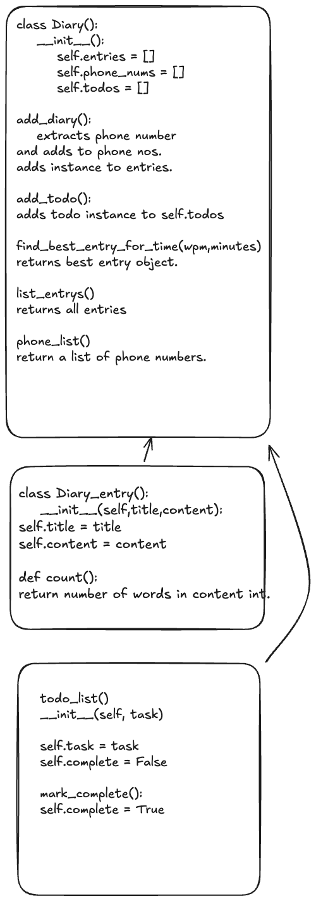

# {{PROBLEM}} Class Design Recipe

Copy this into a `recipe.md` in your project and fill it out.

## 1. Describe the Problem

_Put or write the user story here. Add any clarifying notes you might have._

As a user
So that I can record my experiences
I want to keep a regular diary

As a user
So that I can reflect on my experiences
I want to read my past diary entries

As a user
So that I can reflect on my experiences in my busy day
I want to select diary entries to read based on how much time I have and my reading speed

As a user
So that I can keep track of my tasks
I want to keep a todo list along with my diary

As a user
So that I can keep track of my contacts
I want to see a list of all of the mobile phone numbers in all my diary entries

## 2. Design the Class Interface

_Include the initializer, public properties, and public methods with all parameters, return values, and side-effects._

```python
# EXAMPLE




class Diary():
    # User-facing properties:
    #   name: string

    def __init__(self):
        # Parameters:
        #   none
        # Side effects:
        #   none
        # stores the lists in which the diary entry instances, todos and phone numbers are assigned
        self.entries = []
        self.phone_numbers = []
        self._todos = []


    def add_diary(self, diary_instance):
        # Parameters:
        #   item: diary_instance class
        # Returns:
        #   Nothing
        # Side-effects
        #   Saves the diary_entry to the self.entries list
        # Side-effects:
        #   Throws an exception if no instance is passed
        pass # No code here yet

    def add_todo(self, todo_instance):
        # Parameters:
        #   item: todo_instance class
        # Returns:
        #   Nothing
        # Side-effects
        #   Saves the todo_instnace to the self.todos list
        # Side-effects:
        #   Throws an exception if no instance is passed
        pass # No code here yet

    def list_diary_entries(self):
        # Returns:
            #a list of all diary_entries

    def find_best_entry_for_reading_time(wmp, minutes)
        #user diary_entry.count() on all entries to grab best entry for number of words user can read.
        returns best entry object

    def phone_list():
        returns list of phone numbers.


class Diary_entry():
    def __init__.py(self,title,content):
        self.title = title
        self.content = content

    def count(wpm,minutes):
        #returns number of words in content
        pass


class Todo_list():
    def __init__(self, task):
        self.task = task
        self.complete = False

    def mark_complete(self):
        self.complete = True
```

## 3. Create Examples as Tests

_Make a list of examples of how the class will behave in different situations._

```python
# EXAMPLE
Todo() tests
"""
Given a todo item
#instance stores the todo and complete = false

"""
todo_list = Todo_List("first todo item")
assert isinstnace(todo_list, Todo_List)
assert todo_list.task = "first todo item"
assert todo_list.complete = False


"""
Given a todo item, mark_complete() sets to false
"""
todo_list = Todo_List("walk the dog")
todo_list.mark_complete()

todo_list.complete = True


Diary_Entry() tests

"""

passed a title and content, initializer sets self.title and self.content

"""
diary_entry = Diary_Entry("title1","content one two three")
assert isinstance(diary_entry, Diary_Entry)
assert diary_entry.title == "title1"
assert diary_entry.content == "content one two three"

"""

count return number of words in content
"""
diary_entry = Diary_Entry("title1","content one two three")
assert diary_entry.count() === 4


Diary() tests
"""
checks if instance is made
"""
diary = Diary()
assert isinstance(diary, Diary)


Diary integration tests
"""
add_diary(diary_entry_instance) takes in diary_entry, extracts any phone numbers and adds them to self.phone_numbers. adds full entry class to self.entries.
"""

diary = Diary()
diary_entry1("title123","content blah blah 07590750721")
diary.add_diary(diary_entry1)
assert diary.entries = [diary_entry1]
assert diary.phone_numbers = ['07590750721']
"""

add_todo adds todo_instance to self.todos
"""
diary = Diary()
todo_list1 = Todo_List("walk the dog")
diary.add_todo(todo_list1)
diary.todos = [todo_list1]
"""

find_best_entry_for_time(wpm,minutes) uses diary_entry.count() to get the length of all entries...
using wpm * minutes = max number of words => best diaru_entry instance
"""
diary = Diary()
diary_entry1 = Diary_entry("title123","one two three four five six 07590750721")
diary_entry2 = Diary_entry("one two three four five six seven eight")
diary.add_diary(diary_entry1)
diary.add_diary(diary_entry2)
assert diary.find_best_entry_for_time(2,4) == [diary_entry2] #both todo_list1 & todo_list2 would be readable but we want longest possible.
"""

list_entries() return full list of diary_entries
"""
diary = Diary()
diary_entry1 = Diary_entry("title123","one two three four five six 07590750721")
diary_entry2 = Diary_entry("one two three four five six seven eight")
diary.add_diary(diary_entry1)
diary.add_diary(diary_entry2)
assert diary.list_entries() = [diary_entry1,diary_entry2]
"""

phone_list() return list of phone numbers from diary
"""
diary = Diary()
diary_entry1 = Diary_entry("title123","one two three four five six 07590123456")
diary_entry2 = Diary_entry("one two three four five six seven eight 07850654321")
diary.add_diary(diary_entry1)
diary.add_diary(diary_entry2)
assert diary.phone_list() == ['07590123456','07850654321']


_Encode each example as a test. You can add to the above list as you go._

## 4. Implement the Behaviour

_After each test you write, follow the test-driving process of red, green, refactor to implement the behaviour._
```
